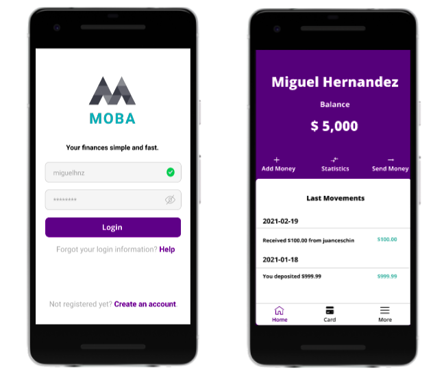
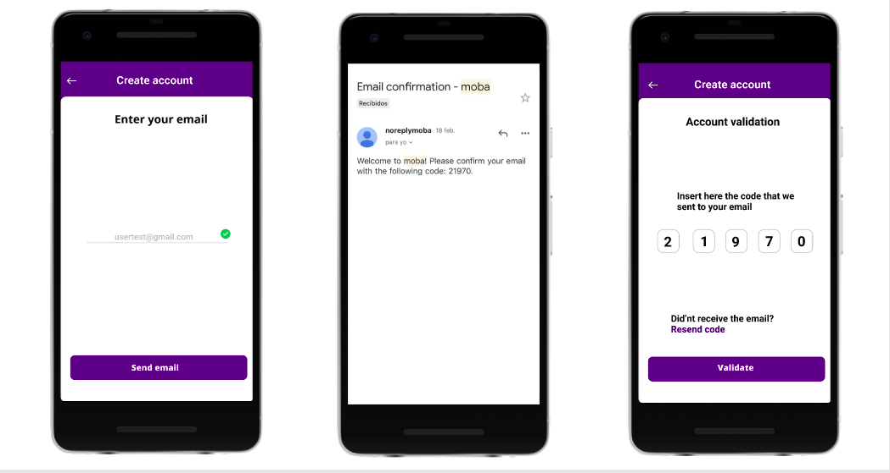
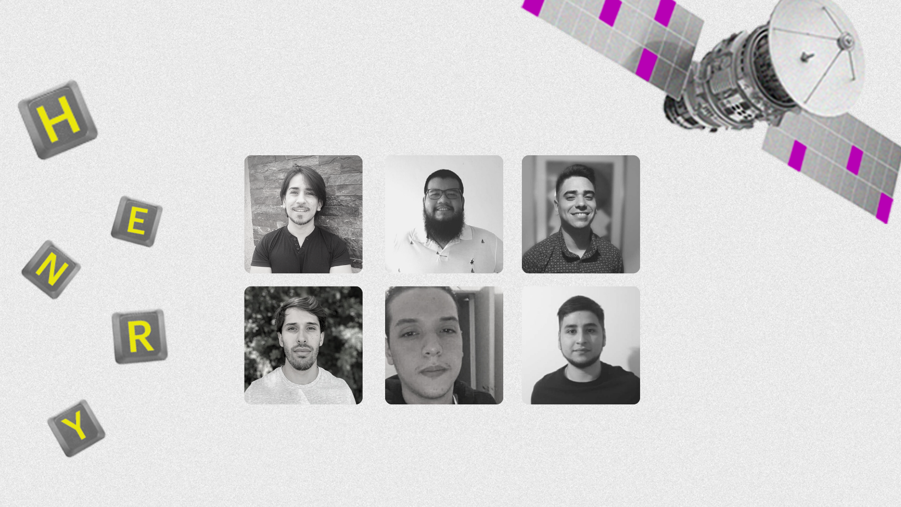

# MOBA <g-emoji class="g-emoji" alias="classical_building" fallback-src="https://github.githubassets.com/images/icons/emoji/unicode/1f3db.png">🏛️</g-emoji> <g-emoji class="g-emoji" alias="iphone" fallback-src="https://github.githubassets.com/images/icons/emoji/unicode/1f4f1.png">📱</g-emoji>

> Mobile project presented for Henry Bootcamp.

MOBA ("Mobile Bank") arises from the need to provide a simple, comfortable and once aesthetically clean app for the user. We wanted to improve the shortcomings of other available wallets.
In addition to having interoperability with TreeBank(external wallet)

## Overview Video <g-emoji class="g-emoji" alias="eyes" fallback-src="https://github.githubassets.com/images/icons/emoji/unicode/1f440.png">👀</g-emoji>

## Features Video <g-emoji class="g-emoji" alias="movie_camera" fallback-src="https://github.githubassets.com/images/icons/emoji/unicode/1f3a5.png">🎥</g-emoji> 

## Images(Figma) <g-emoji class="g-emoji" alias="framed_picture" fallback-src="https://github.githubassets.com/images/icons/emoji/unicode/1f5bc.png">🖼️</g-emoji>

### Programming Language <g-emoji class="g-emoji" alias="tongue" fallback-src="https://github.githubassets.com/images/icons/emoji/unicode/1f445.png">👅</g-emoji>

- JavaScript

### Technologies <g-emoji class="g-emoji" alias="toolbox" fallback-src="https://github.githubassets.com/images/icons/emoji/unicode/1f9f0.png">🧰</g-emoji>

#### BackEnd <g-emoji class="g-emoji" alias="back" fallback-src="https://github.githubassets.com/images/icons/emoji/unicode/1f519.png">🔙</g-emoji>

- NodeJs
- Express.js
- Express Gateway (microservices)
- PostgreSQL
- Sequelize
- Nodemailer

#### FrontEnd <g-emoji class="g-emoji" alias="soon" fallback-src="https://github.githubassets.com/images/icons/emoji/unicode/1f51c.png">🔜</g-emoji>

- React Native
- Expo
- Redux
- React Navigation
- Formik
- Axios
- Async Storage
- Figma

### Blog <g-emoji class="g-emoji" alias="memo" fallback-src="https://github.githubassets.com/images/icons/emoji/unicode/1f4dd.png">📝</g-emoji>

> Interview about our work in the project [Here](https://blog.soyhenry.com/la-billetera-virtual-que-programaron-estudiantes-de-henry/)

## Colaborators <g-emoji class="g-emoji" alias="man_technologist" fallback-src="https://github.githubassets.com/images/icons/emoji/unicode/1f468-1f4bb.png">👨‍💻</g-emoji>

### BackEnd:
- [Facundo Ortiz](https://github.com/facu98)
- [Rodriguez Ibrahin](https://github.com/RodriguezIbrahin)
- [Lucas Gualampa](https://github.com/lucasgualampa)
- [Jose Luis Ramirez](https://github.com/jose640)
### FrontEnd:
- [Juan Ceschin Guntsche](https://github.com/jceschin)
- [Miguel José Hernández](https://github.com/migueljh)
- [Jairo M. Ponti](https://github.com/JairoPonti)
- [Iván Acosta Carabajal](https://github.com/Ivanovicc)
